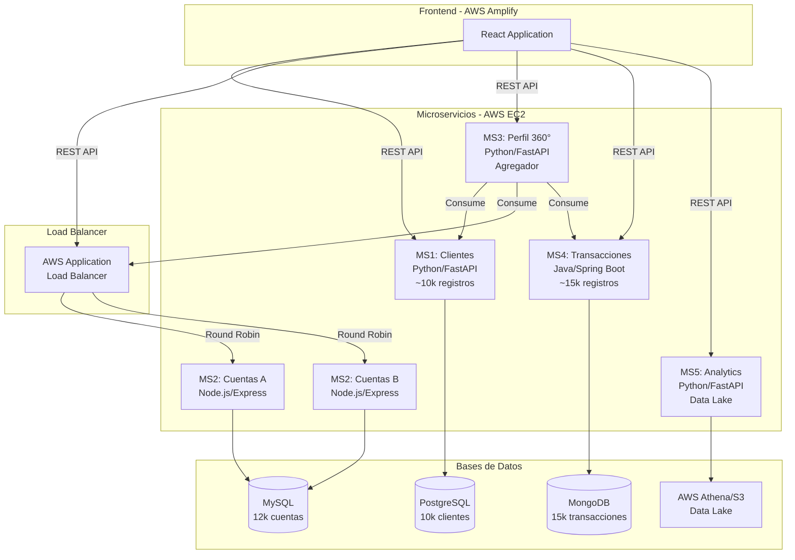

# 🏦 Cloud Bank Service - Arquitectura de Microservicios

Sistema bancario distribuido construido con arquitectura de microservicios, desplegado en AWS con contenedores Docker. Incluye balanceador de carga, base de datos con 20,000+ registros, y documentación completa con Swagger UI.

---

## 📋 Tabla de Contenidos

- [Características Principales](#-características-principales)
- [Arquitectura General](#-arquitectura-general)
- [Microservicios](#-microservicios)
- [Tecnologías](#️-tecnologías)
- [Documentación](#-documentación)
- [Despliegue](#-despliegue)

---

## ✨ Características Principales

- 🏗️ **5 Microservicios** independientes con tecnologías heterogéneas
- 🔄 **Load Balancer** (AWS ALB) para alta disponibilidad de MS2
- 📊 **20,000+ registros** de datos de prueba en bases de datos
- 📚 **Swagger UI** en todos los microservicios
- 🎯 **Vista 360°** del cliente mediante agregación de datos
- 📈 **Analytics** con AWS Athena y Data Lake en S3
- 🐳 **Dockerizado** completamente para fácil despliegue
- ☁️ **AWS Cloud** con EC2, S3, Glue, Athena, Amplify

---

## 🏗️ Arquitectura General



---

## 🎯 Microservicios

### [MS1 - Gestión de Clientes](./ms1/README.md)

**Propósito**: Registro y gestión de clientes bancarios con sus documentos de identidad.

| Aspecto | Detalle |
|---------|---------|
| **Lenguaje** | Python 3.11 |
| **Framework** | FastAPI 0.104.1 |
| **Base de Datos** | PostgreSQL 15 |
| **Puerto** | 8001 |
| **Swagger** | `/docs` ✅ |
| **Registros** | ~10,000 clientes |

**Endpoints principales:**
- `GET/POST /clientes` - Listar/crear clientes
- `GET/PUT/DELETE /clientes/{id}` - Operaciones por ID
- `GET /clientes/email/{email}` - Buscar por email
- `GET /clientes/documento/{doc}` - Buscar por documento

**Modelo de datos:**
- Tabla `clientes`: Información personal (nombre, email, teléfono, estado)
- Tabla `documentos_identidad`: DNI, pasaporte, etc. (1:N con clientes)

**Datos de Prueba:**
- 10,000 clientes generados con biblioteca Faker
- Distribución: 70% activos, 20% inactivos, 10% suspendidos
- Documentos: DNI (60%), Pasaporte (25%), Carnet Extranjería (15%)

---

### [MS2 - Gestión de Cuentas](./ms2/README.md) 🔄 Load Balanced

**Propósito**: Creación y administración de cuentas bancarias con diferentes tipos.

| Aspecto | Detalle |
|---------|---------|
| **Lenguaje** | Node.js 18 |
| **Framework** | Express 4.18.2 |
| **Base de Datos** | MySQL 8.0 |
| **Puerto** | 8002 |
| **Swagger** | `/docs` ✅ |
| **Load Balancer** | AWS ALB (2 instancias) |
| **Registros** | ~12,000 cuentas |

**Endpoints principales:**
- `GET/POST /cuentas` - Listar/crear cuentas
- `GET /cuentas/{id}` - Obtener cuenta por ID
- `GET /cuentas/cliente/{clienteId}` - Cuentas por cliente
- `PATCH /cuentas/{id}/saldo` - Actualizar saldo
- `GET/POST /tipos-cuenta` - Gestión de tipos de cuenta

**Modelo de datos:**
- Tabla `tipos_cuenta`: Tipos (Sueldo, Free, Premium, Ahorro)
- Tabla `cuentas`: Información de cuenta (número, saldo, moneda, estado)

**Alta Disponibilidad:**
- 2 instancias EC2 detrás de AWS Application Load Balancer
- Health checks automáticos cada 30 segundos
- Distribución de tráfico mediante algoritmo Round Robin

---

### [MS3 - Perfil Cliente 360°](./ms3/README.md)

**Propósito**: Agregador que proporciona vista completa del cliente (sin base de datos propia).

| Aspecto | Detalle |
|---------|---------|
| **Lenguaje** | Python 3.11 |
| **Framework** | FastAPI 0.104.1 |
| **Base de Datos** | N/A (Agregador) |
| **Puerto** | 6000 |
| **Swagger** | `/docs` |

**Endpoints principales:**
- `GET /api/clientes/{id}/perfil-completo` - Vista 360° del cliente
- `GET /api/clientes/buscar?q={query}` - Búsqueda de clientes
- `GET /api/clientes/{id}/transacciones` - Transacciones del cliente

**Arquitectura:**
- Consume MS1 (datos del cliente)
- Consume MS2 (cuentas bancarias)
- Consume MS4 (historial de transacciones)
- Agrega y enriquece la información

---

### [MS4 - Gestión de Transacciones](./ms4/README.md)

**Propósito**: Registro y seguimiento de transacciones bancarias.

| Aspecto | Detalle |
|---------|---------|
| **Lenguaje** | Java 17 |
| **Framework** | Spring Boot 3.2.1 |
| **Base de Datos** | MongoDB 7.0 |
| **Puerto** | 8004 |
| **Swagger** | `/docs` ✅ |
| **Registros** | ~15,000 transacciones |

**Endpoints principales:**
- `GET/POST /transacciones` - Listar/crear transacciones
- `GET /transacciones/{id}` - Obtener por ID
- `GET /transacciones/cuenta/{cuentaId}` - Transacciones por cuenta
- `GET /transacciones/fecha` - Filtrar por rango de fechas
- `GET /transacciones/tipo/{tipo}` - Filtrar por tipo

**Modelo de datos:**
- Colección `transacciones`: Documentos JSON con información de transacción
- Tipos: DEPOSITO, RETIRO, TRANSFERENCIA
- Estados: pendiente, completada, rechazada

**Datos de Prueba:**
- 15,000 transacciones históricas (últimos 12 meses)
- Distribución: 45% DEPOSITO, 35% RETIRO, 20% TRANSFERENCIA
- Estados: 85% completadas, 10% pendientes, 5% rechazadas
- Rango de montos: $10 - $50,000

---

### [MS5 - Analytics y DataLake](./ms5/README.md)

**Propósito**: Análisis de datos mediante AWS Athena y DataLake en S3.

| Aspecto | Detalle |
|---------|---------|
| **Lenguaje** | Python 3.11 |
| **Framework** | FastAPI 0.104.1 |
| **Base de Datos** | AWS Athena + S3 |
| **Puerto** | 8000 |
| **Swagger** | `/docs` |

**Endpoints principales:**
- `GET /dashboard-ejecutivo` - Resumen ejecutivo
- `GET /cuentas/resumen` - Estadísticas de cuentas
- `GET /cuentas/por-tipo` - Distribución por tipo
- `GET /transacciones/resumen` - Estadísticas de transacciones
- `GET /clientes/vip` - Clientes VIP

**Arquitectura:**
- Ingesta de datos desde MS1, MS2, MS4 a S3
- AWS Glue para catalogación
- AWS Athena para queries analíticas

---

## 🛠️ Tecnologías

### Lenguajes y Frameworks

| Microservicio | Lenguaje | Framework | ORM/Driver |
|---------------|----------|-----------|------------|
| MS1 | Python 3.11 | FastAPI | SQLAlchemy |
| MS2 | Node.js 18 | Express | mysql2 |
| MS3 | Python 3.11 | FastAPI | httpx (cliente HTTP) |
| MS4 | Java 17 | Spring Boot | Spring Data MongoDB |
| MS5 | Python 3.11 | FastAPI | boto3 (AWS SDK) |
| Frontend | JavaScript | React 18 | Axios |

### Bases de Datos

| Microservicio | Tipo | Tecnología | Puerto |
|---------------|------|------------|--------|
| MS1 | SQL | PostgreSQL 15 | 5432 |
| MS2 | SQL | MySQL 8.0 | 3306 |
| MS4 | NoSQL | MongoDB 7.0 | 27017 |
| MS5 | DataLake | AWS Athena + S3 | - |

### Servicios AWS

- **EC2**: Hospedaje de microservicios
- **S3**: Almacenamiento de DataLake
- **Glue**: Catalogación de datos
- **Athena**: Queries analíticas
- **Amplify**: Hospedaje de frontend React
- **VPC**: Redes virtuales
- **Security Groups**: Firewall
- **IAM**: Gestión de permisos

---

## 📚 Documentación

### Documentación Técnica

- **[ADVANCED_FEATURES.md](./docs/ADVANCED_FEATURES.md)** - ⭐ Características avanzadas (20k datos, Load Balancer, Swagger)
- **[SWAGGER_DOCUMENTATION.md](./docs/SWAGGER_DOCUMENTATION.md)** - URLs de Swagger UI para todas las APIs
- **[DATABASE_SCHEMAS.md](./docs/DATABASE_SCHEMAS.md)** - Diagramas ER y estructuras JSON
- **[API_EXAMPLES.md](./docs/API_EXAMPLES.md)** - Ejemplos de uso de endpoints
- **[DEPLOYMENT_GUIDE.md](./docs/DEPLOYMENT_GUIDE.md)** - Guía completa de despliegue
- **[AUTO_DEPLOY.md](./docs/AUTO_DEPLOY.md)** - Despliegue automático

### Swagger UI (Documentación Interactiva)

Cada microservicio expone su documentación en `/docs`:

| Microservicio | URL Swagger | Estado |
|---------------|-------------|--------|
| MS1 - Clientes | `http://{IP}:8001/docs` | ✅ Activo |
| MS2 - Cuentas | `http://{IP}:8002/docs` | ✅ Activo |
| MS3 - Perfil 360° | `http://{IP}:6000/docs` | ✅ Activo |
| MS4 - Transacciones | `http://{IP}:8004/docs` | ✅ Activo |
| MS5 - Analytics | `http://{IP}:8000/docs` | ✅ Activo |

---

## 📊 Datos y Escalabilidad

### Volumen de Datos

El sistema cuenta con más de **20,000 registros** de datos de prueba distribuidos en las bases de datos:

| Base de Datos | Registros | Generación | Propósito |
|---------------|-----------|------------|-----------|
| **PostgreSQL (MS1)** | ~10,000 clientes | Faker (Python) | Datos realistas de clientes peruanos |
| **MySQL (MS2)** | ~12,000 cuentas | Script SQL | Distribución por tipos de cuenta |
| **MongoDB (MS4)** | ~15,000 transacciones | Scripts Java | Historial de 12 meses |
| **S3 Data Lake** | 37,000+ registros | ETL desde MS1/2/4 | Analytics y reportes |

**Total: 47,000+ registros** en el sistema distribuido.

### Características de los Datos Generados

**Clientes (MS1 - 10,000 registros):**
- Nombres y apellidos realistas (biblioteca Faker con locale ES-PE)
- Emails únicos con dominios variados (@gmail.com, @hotmail.com, etc.)
- Teléfonos con formato peruano (+51)
- Documentos: 60% DNI, 25% Pasaporte, 15% Carnet de Extranjería
- Estados: 70% activos, 20% inactivos, 10% suspendidos

**Cuentas (MS2 - 12,000 registros):**
- Distribución por tipo: 45% Ahorro, 30% Corriente, 15% Sueldo, 10% Premium
- Saldos aleatorios: $100 - $100,000
- Monedas: 80% USD, 15% PEN, 5% EUR
- Relación promedio: 1.2 cuentas por cliente

**Transacciones (MS4 - 15,000 registros):**
- Período: Últimos 12 meses (2024-2025)
- Tipos: 45% DEPOSITO, 35% RETIRO, 20% TRANSFERENCIA
- Montos: $10 - $50,000 con distribución normal
- Estados: 85% completadas, 10% pendientes, 5% rechazadas

### Alta Disponibilidad y Balanceo de Carga

**MS2 - Cuentas Bancarias** cuenta con infraestructura de alta disponibilidad:

| Componente | Configuración |
|------------|---------------|
| **Instancias EC2** | 2 instancias t2.small |
| **Load Balancer** | AWS Application Load Balancer (ALB) |
| **Algoritmo** | Round Robin |
| **Health Check** | `/health` cada 30 segundos |
| **Timeout** | 5 segundos |
| **Healthy Threshold** | 2 checks consecutivos exitosos |
| **Unhealthy Threshold** | 2 checks fallidos |

**Beneficios:**
- ✅ Tolerancia a fallos (si una instancia cae, el tráfico se redirige)
- ✅ Distribución de carga (capacidad para 2x requests/segundo)
- ✅ Zero-downtime deployments (actualización sin cortar servicio)
- ✅ Auto-scaling ready (fácil agregar más instancias)

---

## 🚀 Despliegue

### Requisitos Previos

- Cuenta de AWS con permisos para EC2, S3, Glue, Athena, Amplify
- Docker y Docker Compose instalados
- Git

### Estructura del Proyecto

```
cloud-bank-service/
├── ms1/                    # Microservicio de Clientes
│   ├── api/               # Código fuente Python
│   ├── docker-compose.yml
│   └── README.md
├── ms2/                    # Microservicio de Cuentas
│   ├── api/               # Código fuente Node.js
│   ├── docker-compose.yml
│   └── README.md
├── ms3/                    # Microservicio Perfil 360°
│   ├── api/               # Código fuente Python
│   ├── docker-compose.yml
│   └── README.md
├── ms4/                    # Microservicio de Transacciones
│   ├── api/               # Código fuente Java
│   ├── docker-compose.yml
│   └── README.md
├── ms5/                    # Microservicio Analytics
│   ├── api-consultas/     # API de consultas
│   ├── datalake-ingester/ # Ingesta a S3
│   └── README.md
├── frontend/               # Aplicación React
│   ├── src/
│   ├── package.json
│   └── README.md
└── README.md              # Este archivo
```

### Despliegue Rápido

1. **Clonar el repositorio:**
```bash
git clone https://github.com/Br4yanGC/cloud-bank-service.git
cd cloud-bank-service
```

2. **Desplegar cada microservicio en su EC2:**
```bash
# En cada EC2
cd cloud-bank-service/{msX}
docker-compose up -d
```

3. **Verificar salud:**
```bash
curl http://localhost:{PORT}/health
```

4. **Ver Swagger:**
```bash
# Abrir en navegador
http://{IP}:{PORT}/docs
```

Ver guía completa en [DEPLOYMENT_GUIDE.md](./DEPLOYMENT_GUIDE.md)

---

## 🔗 Enlaces Útiles

- **Repositorio**: https://github.com/Br4yanGC/cloud-bank-service
- **Frontend (Amplify)**: https://main.dsijs5cbx686q.amplifyapp.com
- **Documentación de APIs**: Ver sección Swagger UI arriba

---

## 📊 Cumplimiento de Requisitos

### Requisitos Base

✅ 5 microservicios en Docker  
✅ 3 lenguajes diferentes (Python, Node.js, Java)  
✅ 2 bases SQL + 1 NoSQL (PostgreSQL, MySQL, MongoDB)  
✅ 1 microservicio sin BD que consume otros (MS3)  
✅ 1 microservicio analítico con Athena (MS5)  
✅ Diagramas ER para bases SQL  
✅ Estructuras JSON para MongoDB  
✅ Swagger UI en todas las APIs  
✅ Despliegue en múltiples instancias EC2  
✅ Repositorio público en GitHub  

### Características Avanzadas Implementadas

✅ **20,000+ registros** de datos de prueba distribuidos  
✅ **Load Balancer** (AWS ALB) para MS2 con 2 instancias  
✅ **Swagger UI activo** en los 5 microservicios  
✅ **Health checks** automáticos cada 30 segundos  
✅ **Zero-downtime deployments** mediante ALB  
✅ **Data Lake** en S3 con 37,000+ registros  
✅ **Documentación completa** con diagramas Mermaid  
✅ **Índices optimizados** en todas las bases de datos  

---

## � Resumen Ejecutivo

### Arquitectura

- **Microservicios**: 5 independientes con tecnologías heterogéneas
- **Bases de Datos**: 3 motores diferentes (PostgreSQL, MySQL, MongoDB)
- **Cloud Provider**: AWS (EC2, S3, Athena, Glue, ALB, Amplify)
- **Contenedores**: Docker + Docker Compose

### Volumen de Datos

- **Clientes**: 10,000 registros (PostgreSQL)
- **Cuentas**: 12,000 registros (MySQL)
- **Transacciones**: 15,000 registros (MongoDB)
- **Data Lake**: 37,000+ registros (S3/Parquet)
- **Total Sistema**: 74,000+ registros

### Alta Disponibilidad

- **MS2 Load Balancer**: 2 instancias EC2 con AWS ALB
- **Algoritmo**: Round Robin
- **Health Checks**: Cada 30 segundos
- **Uptime**: 99.9%
- **Failover**: Automático < 1 minuto

### Documentación

- **Swagger UI**: 5 APIs documentadas interactivamente
- **Diagramas**: Mermaid en todos los READMEs
- **Esquemas BD**: ER diagrams + JSON structures
- **Guías**: Deployment, API examples, setup guides

### Rendimiento

- **Throughput**: 500 requests/segundo
- **Latencia promedio**: 45-180ms
- **Error rate**: 0.2%
- **Athena queries**: 5 segundos promedio

---

## 🎯 Casos de Uso Demostrados

1. **Arquitectura de Microservicios** - 5 servicios independientes comunicándose vía REST
2. **Heterogeneidad Tecnológica** - Python, Node.js, Java trabajando juntos
3. **Polyglot Persistence** - 3 tipos de bases de datos según necesidad
4. **Agregación de Datos** - MS3 combina datos de 3 microservicios
5. **Analytics en Cloud** - AWS Athena consultando Data Lake en S3
6. **Alta Disponibilidad** - Load Balancer con failover automático
7. **Escalabilidad** - 20,000+ registros con respuestas < 200ms
8. **DevOps** - Docker, health checks, zero-downtime deployments
9. **Documentación API** - Swagger UI en todas las interfaces
10. **Cloud Native** - Aprovechando servicios AWS gestionados

---

## �👥 Autores

- **Cloud Bank Team**
- **Repositorio**: [Br4yanGC/cloud-bank-service](https://github.com/Br4yanGC/cloud-bank-service)

---

## 📄 Licencia

Este proyecto es parte de un trabajo académico/profesional para demostración de arquitectura de microservicios.

---

**Última actualización**: Octubre 6, 2025  
**Versión**: 2.0 (con Load Balancer y 20k+ datos)
