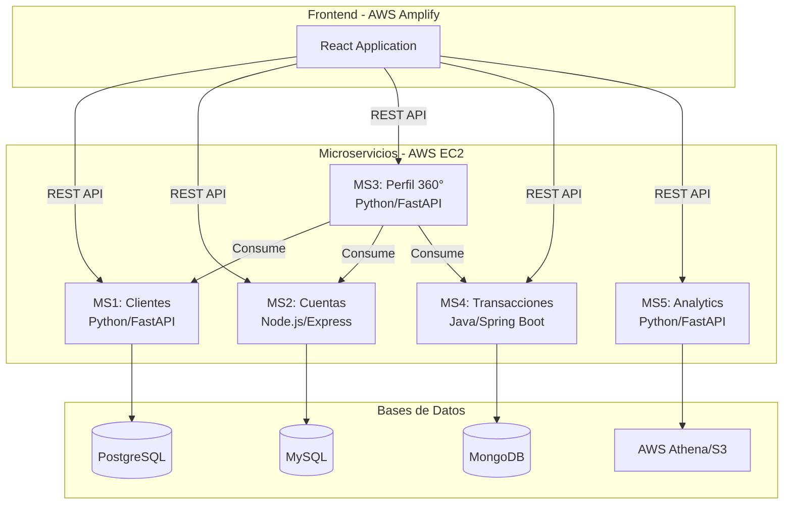

# 🏦 Cloud Bank Service - Arquitectura de Microservicios

Sistema bancario distribuido construido con arquitectura de microservicios, desplegado en AWS con contenedores Docker.

---

## 📋 Tabla de Contenidos

- [Arquitectura General](#-arquitectura-general)
- [Microservicios](#-microservicios)
- [Tecnologías](#️-tecnologías)
- [Documentación](#-documentación)
- [Despliegue](#-despliegue)

---

## 🏗️ Arquitectura General



---

## 🎯 Microservicios

### [MS1 - Gestión de Clientes](./ms1/README.md)

**Propósito**: Registro y gestión de clientes bancarios con sus documentos de identidad.

| Aspecto | Detalle |
|---------|---------|
| **Lenguaje** | Python 3.11 |
| **Framework** | FastAPI 0.104.1 |
| **Base de Datos** | PostgreSQL 15 |
| **Puerto** | 8001 |
| **Swagger** | `/docs` |

**Endpoints principales:**
- `GET/POST /clientes` - Listar/crear clientes
- `GET/PUT/DELETE /clientes/{id}` - Operaciones por ID
- `GET /clientes/email/{email}` - Buscar por email
- `GET /clientes/documento/{doc}` - Buscar por documento

**Modelo de datos:**
- Tabla `clientes`: Información personal (nombre, email, teléfono, estado)
- Tabla `documentos_identidad`: DNI, pasaporte, etc. (1:N con clientes)

---

### [MS2 - Gestión de Cuentas](./ms2/README.md)

**Propósito**: Creación y administración de cuentas bancarias con diferentes tipos.

| Aspecto | Detalle |
|---------|---------|
| **Lenguaje** | Node.js 18 |
| **Framework** | Express 4.18.2 |
| **Base de Datos** | MySQL 8.0 |
| **Puerto** | 8002 |
| **Swagger** | `/docs` |

**Endpoints principales:**
- `GET/POST /cuentas` - Listar/crear cuentas
- `GET /cuentas/{id}` - Obtener cuenta por ID
- `GET /cuentas/cliente/{clienteId}` - Cuentas por cliente
- `PATCH /cuentas/{id}/saldo` - Actualizar saldo
- `GET/POST /tipos-cuenta` - Gestión de tipos de cuenta

**Modelo de datos:**
- Tabla `tipos_cuenta`: Tipos (Sueldo, Free, Premium, Ahorro)
- Tabla `cuentas`: Información de cuenta (número, saldo, moneda, estado)

---

### [MS3 - Perfil Cliente 360°](./ms3/README.md)

**Propósito**: Agregador que proporciona vista completa del cliente (sin base de datos propia).

| Aspecto | Detalle |
|---------|---------|
| **Lenguaje** | Python 3.11 |
| **Framework** | FastAPI 0.104.1 |
| **Base de Datos** | N/A (Agregador) |
| **Puerto** | 6000 |
| **Swagger** | `/docs` |

**Endpoints principales:**
- `GET /api/clientes/{id}/perfil-completo` - Vista 360° del cliente
- `GET /api/clientes/buscar?q={query}` - Búsqueda de clientes
- `GET /api/clientes/{id}/transacciones` - Transacciones del cliente

**Arquitectura:**
- Consume MS1 (datos del cliente)
- Consume MS2 (cuentas bancarias)
- Consume MS4 (historial de transacciones)
- Agrega y enriquece la información

---

### [MS4 - Gestión de Transacciones](./ms4/README.md)

**Propósito**: Registro y seguimiento de transacciones bancarias.

| Aspecto | Detalle |
|---------|---------|
| **Lenguaje** | Java 17 |
| **Framework** | Spring Boot 3.2.1 |
| **Base de Datos** | MongoDB 7.0 |
| **Puerto** | 8004 |
| **Swagger** | `/docs` |

**Endpoints principales:**
- `GET/POST /transacciones` - Listar/crear transacciones
- `GET /transacciones/{id}` - Obtener por ID
- `GET /transacciones/cuenta/{cuentaId}` - Transacciones por cuenta
- `GET /transacciones/fecha` - Filtrar por rango de fechas
- `GET /transacciones/tipo/{tipo}` - Filtrar por tipo

**Modelo de datos:**
- Colección `transacciones`: Documentos JSON con información de transacción
- Tipos: DEPOSITO, RETIRO, TRANSFERENCIA
- Estados: pendiente, completada, rechazada

---

### [MS5 - Analytics y DataLake](./ms5/README.md)

**Propósito**: Análisis de datos mediante AWS Athena y DataLake en S3.

| Aspecto | Detalle |
|---------|---------|
| **Lenguaje** | Python 3.11 |
| **Framework** | FastAPI 0.104.1 |
| **Base de Datos** | AWS Athena + S3 |
| **Puerto** | 8000 |
| **Swagger** | `/docs` |

**Endpoints principales:**
- `GET /dashboard-ejecutivo` - Resumen ejecutivo
- `GET /cuentas/resumen` - Estadísticas de cuentas
- `GET /cuentas/por-tipo` - Distribución por tipo
- `GET /transacciones/resumen` - Estadísticas de transacciones
- `GET /clientes/vip` - Clientes VIP

**Arquitectura:**
- Ingesta de datos desde MS1, MS2, MS4 a S3
- AWS Glue para catalogación
- AWS Athena para queries analíticas

---

## 🛠️ Tecnologías

### Lenguajes y Frameworks

| Microservicio | Lenguaje | Framework | ORM/Driver |
|---------------|----------|-----------|------------|
| MS1 | Python 3.11 | FastAPI | SQLAlchemy |
| MS2 | Node.js 18 | Express | mysql2 |
| MS3 | Python 3.11 | FastAPI | httpx (cliente HTTP) |
| MS4 | Java 17 | Spring Boot | Spring Data MongoDB |
| MS5 | Python 3.11 | FastAPI | boto3 (AWS SDK) |
| Frontend | JavaScript | React 18 | Axios |

### Bases de Datos

| Microservicio | Tipo | Tecnología | Puerto |
|---------------|------|------------|--------|
| MS1 | SQL | PostgreSQL 15 | 5432 |
| MS2 | SQL | MySQL 8.0 | 3306 |
| MS4 | NoSQL | MongoDB 7.0 | 27017 |
| MS5 | DataLake | AWS Athena + S3 | - |

### Servicios AWS

- **EC2**: Hospedaje de microservicios
- **S3**: Almacenamiento de DataLake
- **Glue**: Catalogación de datos
- **Athena**: Queries analíticas
- **Amplify**: Hospedaje de frontend React
- **VPC**: Redes virtuales
- **Security Groups**: Firewall
- **IAM**: Gestión de permisos

---

## 📚 Documentación

### Documentación Técnica

- **[SWAGGER_DOCUMENTATION.md](./SWAGGER_DOCUMENTATION.md)** - URLs de Swagger UI para todas las APIs
- **[DATABASE_SCHEMAS.md](./DATABASE_SCHEMAS.md)** - Diagramas ER y estructuras JSON
- **[API_EXAMPLES.md](./API_EXAMPLES.md)** - Ejemplos de uso de endpoints
- **[DEPLOYMENT_GUIDE.md](./DEPLOYMENT_GUIDE.md)** - Guía completa de despliegue
- **[AUTO_DEPLOY.md](./AUTO_DEPLOY.md)** - Despliegue automático

### Swagger UI (Documentación Interactiva)

Cada microservicio expone su documentación en `/docs`:

| Microservicio | URL Swagger |
|---------------|-------------|
| MS1 - Clientes | `http://{IP}:8001/docs` |
| MS2 - Cuentas | `http://{IP}:8002/docs` |
| MS3 - Perfil 360° | `http://{IP}:6000/docs` |
| MS4 - Transacciones | `http://{IP}:8004/docs` |
| MS5 - Analytics | `http://{IP}:8000/docs` |

---

## 🚀 Despliegue

### Requisitos Previos

- Cuenta de AWS con permisos para EC2, S3, Glue, Athena, Amplify
- Docker y Docker Compose instalados
- Git

### Estructura del Proyecto

```
cloud-bank-service/
├── ms1/                    # Microservicio de Clientes
│   ├── api/               # Código fuente Python
│   ├── docker-compose.yml
│   └── README.md
├── ms2/                    # Microservicio de Cuentas
│   ├── api/               # Código fuente Node.js
│   ├── docker-compose.yml
│   └── README.md
├── ms3/                    # Microservicio Perfil 360°
│   ├── api/               # Código fuente Python
│   ├── docker-compose.yml
│   └── README.md
├── ms4/                    # Microservicio de Transacciones
│   ├── api/               # Código fuente Java
│   ├── docker-compose.yml
│   └── README.md
├── ms5/                    # Microservicio Analytics
│   ├── api-consultas/     # API de consultas
│   ├── datalake-ingester/ # Ingesta a S3
│   └── README.md
├── frontend/               # Aplicación React
│   ├── src/
│   ├── package.json
│   └── README.md
└── README.md              # Este archivo
```

### Despliegue Rápido

1. **Clonar el repositorio:**
```bash
git clone https://github.com/Br4yanGC/cloud-bank-service.git
cd cloud-bank-service
```

2. **Desplegar cada microservicio en su EC2:**
```bash
# En cada EC2
cd cloud-bank-service/{msX}
docker-compose up -d
```

3. **Verificar salud:**
```bash
curl http://localhost:{PORT}/health
```

4. **Ver Swagger:**
```bash
# Abrir en navegador
http://{IP}:{PORT}/docs
```

Ver guía completa en [DEPLOYMENT_GUIDE.md](./DEPLOYMENT_GUIDE.md)

---

## 🔗 Enlaces Útiles

- **Repositorio**: https://github.com/Br4yanGC/cloud-bank-service
- **Frontend (Amplify)**: https://main.dsijs5cbx686q.amplifyapp.com
- **Documentación de APIs**: Ver sección Swagger UI arriba

---

## 📊 Cumplimiento de Requisitos

✅ 5 microservicios en Docker  
✅ 3 lenguajes diferentes (Python, Node.js, Java)  
✅ 2 bases SQL + 1 NoSQL (PostgreSQL, MySQL, MongoDB)  
✅ 1 microservicio sin BD que consume otros (MS3)  
✅ 1 microservicio analítico con Athena (MS5)  
✅ Diagramas ER para bases SQL  
✅ Estructuras JSON para MongoDB  
✅ Swagger UI en todas las APIs  
✅ Despliegue en múltiples instancias EC2  
✅ Repositorio público en GitHub  

---

## 👥 Autores

- **Cloud Bank Team**
- **Repositorio**: [Br4yanGC/cloud-bank-service](https://github.com/Br4yanGC/cloud-bank-service)

---

**Última actualización**: Octubre 2025
