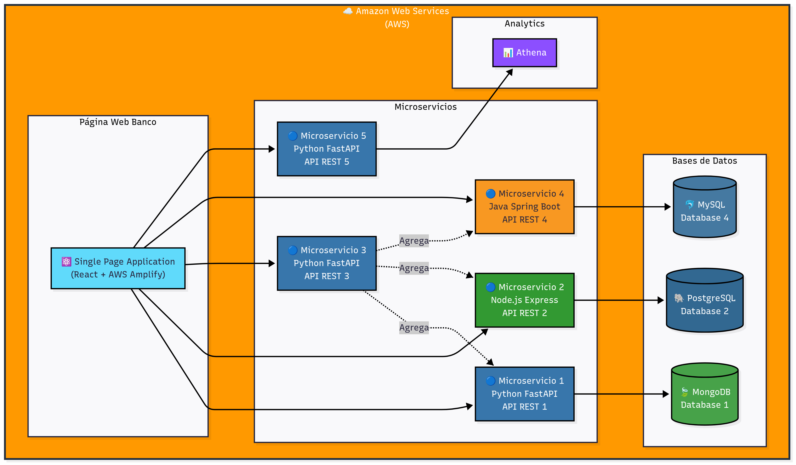
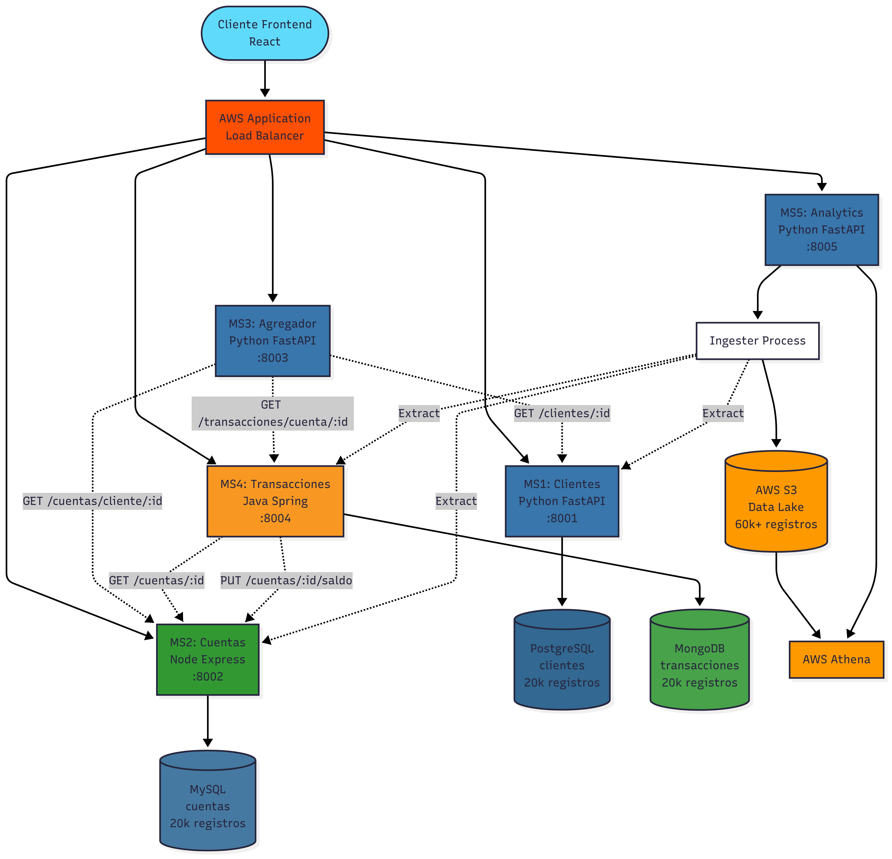
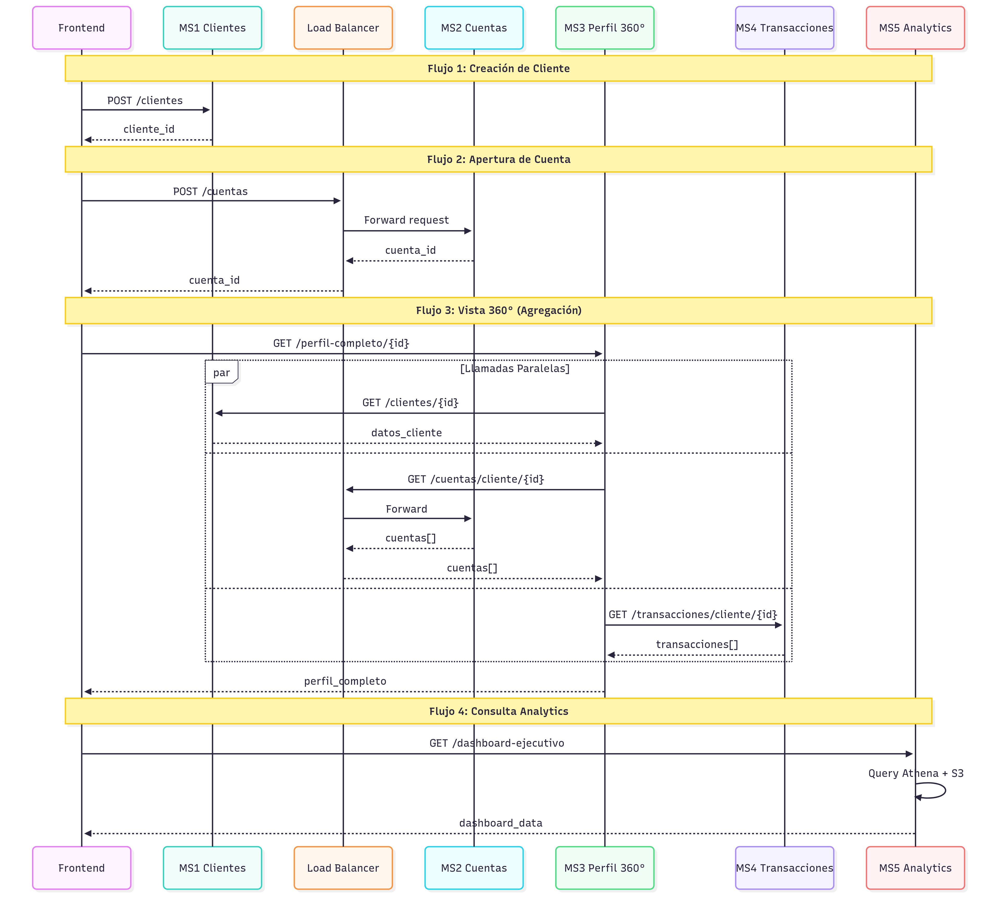
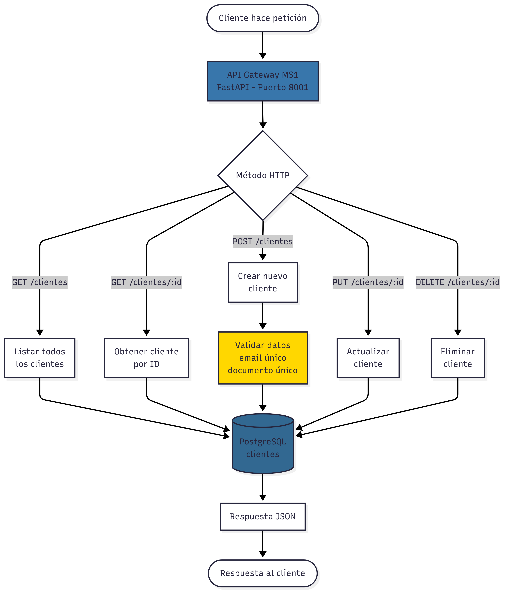
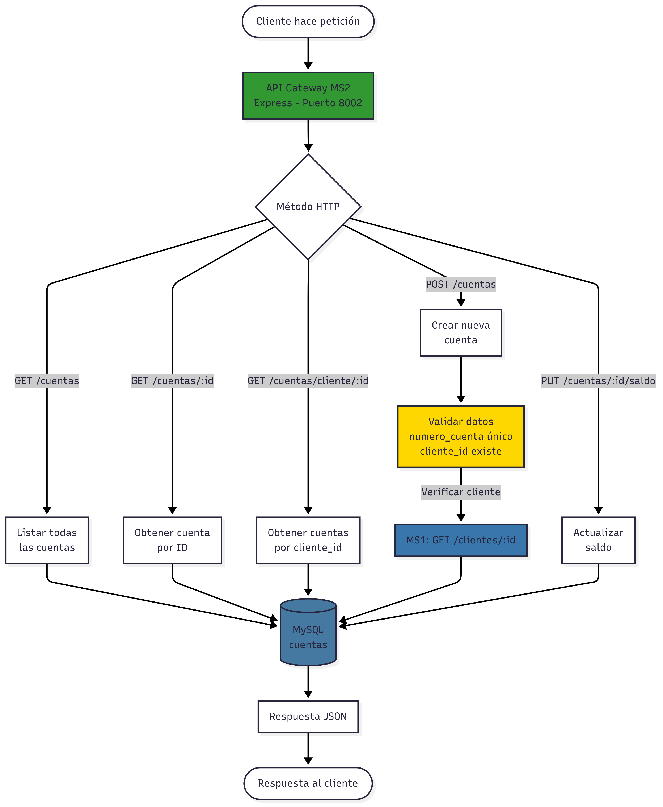
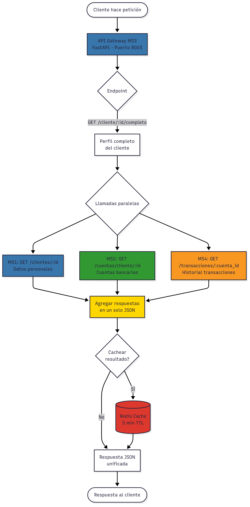
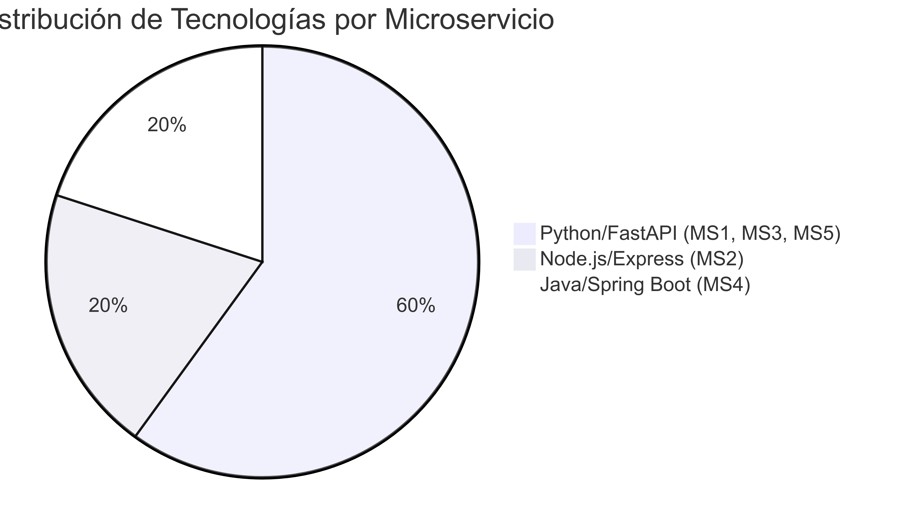
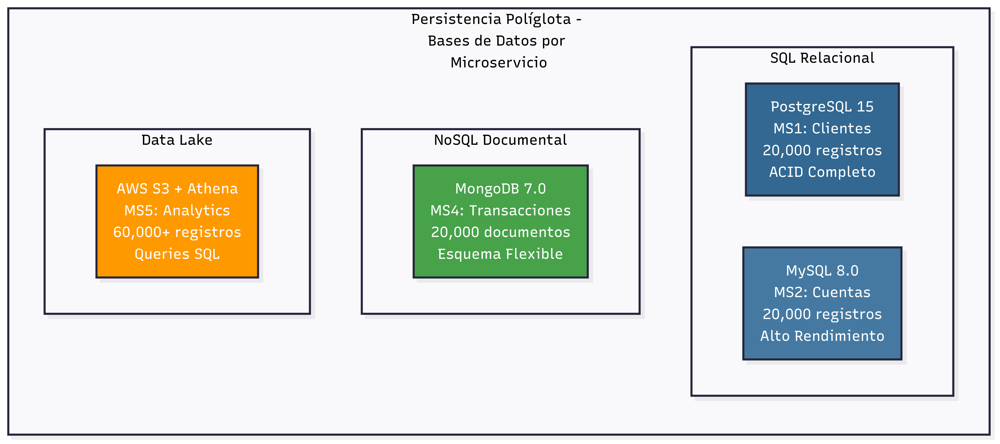
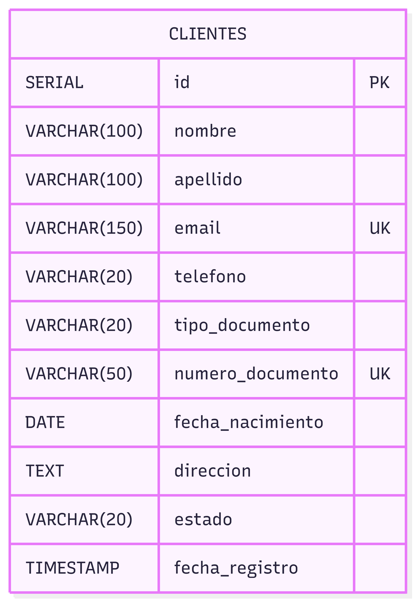
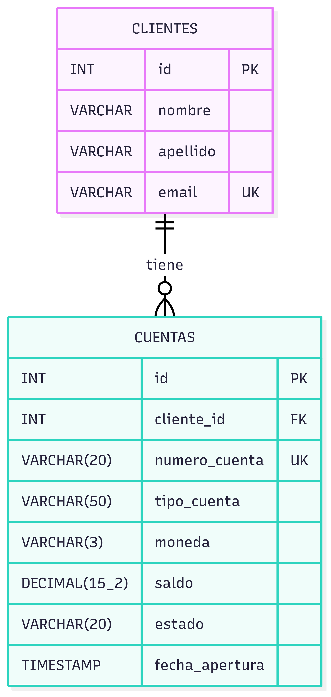

# INFORME TÉCNICO
## Cloud Bank Service
### Sistema Bancario Distribuido con Arquitectura de Microservicios

---

<div align="center">

**Proyecto de Arquitectura de Microservicios en AWS**

**Octubre 2025**

</div>

---

## EQUIPO DE DESARROLLO

| Nombre | Email |
|--------|-------|
| **Anthony Sleiter Aguilar Sanchez** | anthony.aguilar@utec.edu.pe |
| **Efrén Paolo Centeno Rosas** | efren.centeno@utec.edu.pe |
| **Franco Stefano Panizo Muñoz** | franco.panizo@utec.edu.pe |
| **Jhonatan Eder Ortega Huaman** | jhonatan.ortega@utec.edu.pe |
| **Brayan Eduardo Gomero Castillo** | brayan.gomero@utec.edu.pe |

---

## INFORMACIÓN DEL PROYECTO

**Nombre del Proyecto**: Cloud Bank Service  
**Tipo**: Sistema Bancario Distribuido  
**Arquitectura**: Microservicios  
**Cloud Provider**: Amazon Web Services (AWS)  
**Fecha de Entrega**: Octubre 6, 2025  
**Repositorio**: https://github.com/Br4yanGC/cloud-bank-service  
**Frontend Desplegado**: https://main.dsijs5cbx686q.amplifyapp.com

---

## ÍNDICE

1. [Resumen Ejecutivo](#1-resumen-ejecutivo)
2. [Arquitectura del Sistema](#2-arquitectura-del-sistema)
3. [Características Técnicas](#3-características-técnicas)
4. [Servicios AWS Utilizados](#4-servicios-aws-utilizados)
5. [Documentación y APIs](#5-documentación-y-apis)
6. [Patrones de Diseño](#6-patrones-de-diseño)
7. [Casos de Uso](#7-casos-de-uso)
8. [Resumen Visual del Sistema](#8-resumen-visual-del-sistema)
9. [Conclusiones](#9-conclusiones)
10. [Referencias](#10-referencias)

---

<div style="page-break-after: always;"></div>

## 1. RESUMEN EJECUTIVO

Cloud Bank Service es un sistema bancario construido con **arquitectura de microservicios**, desplegado en **Amazon Web Services (AWS)** utilizando contenedores **Docker**. El proyecto implementa **5 microservicios independientes** con **3 lenguajes de programación** (Python, Node.js, Java), **3 tipos de bases de datos** (PostgreSQL, MySQL, MongoDB), y cuenta con **120,000+ registros** de datos de prueba.

El sistema incluye **balanceador de carga** con 2 instancias para alta disponibilidad del frontend, y **documentación API** con Swagger UI en todos los microservicios.

### Características Principales

- ✅ **5 microservicios** independientes con tecnologías heterogéneas
- ✅ **120,000+ registros** de datos de prueba
- ✅ **Load Balancer (AWS ALB)** para alta disponibilidad
- ✅ **Swagger UI** en los 5 microservicios
- ✅ **Data Lake** en S3 con AWS Athena para analytics
- ✅ **Documentación completa** con diagramas de arquitectura

---

<div style="page-break-after: always;"></div>

## 2. ARQUITECTURA DEL SISTEMA

### 2.1 Componentes Principales

| ID | Microservicio | Tecnología | Base de Datos | Registros | Puerto |
|----|---------------|------------|---------------|-----------|--------|
| MS1 | Clientes | Python 3.11 + FastAPI | PostgreSQL 15 | 20,000 | 8001 |
| MS2 | Cuentas | Node.js 18 + Express | MySQL 8.0 | 20,000 | 8002 |
| MS3 | Perfil 360° | Python 3.11 + FastAPI | N/A (Agregador) | - | 6000 |
| MS4 | Transacciones | Java 17 + Spring Boot | MongoDB 7.0 | 20,000 | 8004 |
| MS5 | Analytics | Python 3.11 + FastAPI | AWS Athena/S3 | 60,000+ | 8000 |

**Total de Registros en el Sistema**: **120,000+**

### 2.2 Diagrama de Arquitectura General



**Descripción de Componentes:**

- **Frontend (SPA)**: Aplicación React desplegada en AWS Amplify
- **Microservicio 1**: Python FastAPI + MongoDB (20k registros)
- **Microservicio 2**: Node.js Express + PostgreSQL (20k registros)  
- **Microservicio 3**: Python FastAPI - Agregador (sin BD propia)
- **Microservicio 4**: Java Spring Boot + MySQL (20k registros)
- **Microservicio 5**: Python FastAPI + AWS Athena (60k+ registros)

**Flujo de Datos:**
1. El Frontend (SPA) consume las APIs REST de los 5 microservicios
2. MS3 actúa como agregador, consolidando datos de MS1, MS2 y MS4
3. Cada microservicio (excepto MS3) tiene su propia base de datos
4. MS5 utiliza AWS Athena para queries analíticos sobre Data Lake

### 2.3 Integración Completa del Sistema



**Descripción del Diagrama:**
- **ALB (Application Load Balancer)**: Distribuye el tráfico del frontend entre todos los microservicios
- **Líneas sólidas**: Conexiones directas a bases de datos
- **Líneas punteadas**: Comunicación entre microservicios (API calls)
- **MS3 (Agregador)**: Realiza llamadas paralelas a MS1, MS2 y MS4 para construir perfil completo
- **MS4 → MS2**: Valida cuentas y actualiza saldos en transacciones
- **MS5 Ingester**: Extrae datos de MS1, MS2, MS4 hacia el Data Lake S3

### 2.4 Flujo de Datos y Comunicación



**Principales Flujos de Comunicación:**

1. **Frontend → MS1**: Crear/consultar clientes
2. **Frontend → MS2 (via ALB)**: Gestionar cuentas bancarias con alta disponibilidad
3. **Frontend → MS3**: Obtener vista 360° del cliente (agrega MS1 + MS2 + MS4)
4. **Frontend → MS4**: Registrar y consultar transacciones
5. **Frontend → MS5**: Consultar dashboards y analytics sobre Data Lake

### 2.5 Diagramas de Flujo por Microservicio

#### 2.5.1 MS1 - Gestión de Clientes



**Operaciones CRUD:**
- GET /clientes - Listar todos los clientes
- GET /clientes/:id - Obtener cliente por ID
- POST /clientes - Crear nuevo cliente (validación de email y documento único)
- PUT /clientes/:id - Actualizar cliente
- DELETE /clientes/:id - Eliminar cliente

**Base de datos:** PostgreSQL (20,000 registros)

#### 2.5.2 MS2 - Gestión de Cuentas



**Operaciones principales:**
- GET /cuentas - Listar todas las cuentas
- GET /cuentas/:id - Obtener cuenta por ID
- GET /cuentas/cliente/:id - Obtener cuentas por cliente_id
- POST /cuentas - Crear nueva cuenta (valida cliente_id con MS1)
- PUT /cuentas/:id/saldo - Actualizar saldo

**Base de datos:** MySQL (20,000 registros)

#### 2.5.3 MS3 - API Agregador (Perfil 360°)



**Operación principal:**
- GET /cliente/:id/completo - Obtener perfil completo del cliente

**Proceso:**
1. Recibe petición con cliente_id
2. Realiza **llamadas paralelas** a MS1, MS2 y MS4
3. Agrega respuestas en un solo JSON
4. Opcional: Cachea resultado en Redis (5 min TTL)
5. Retorna perfil unificado

**Nota:** MS3 no tiene base de datos propia, actúa como orquestador.

#### 2.5.4 MS4 - Transacciones Bancarias


**Operaciones principales:**
- GET /transacciones - Listar todas las transacciones
- GET /transacciones/:id - Obtener transacción por ID
- GET /transacciones/cuenta/:id - Obtener por cuenta_id
- POST /transacciones - Crear nueva transacción

**Proceso de creación:**
1. Valida tipo, monto y cuenta
2. Verifica cuenta existe en MS2
3. Si es RETIRO o TRANSFERENCIA, valida saldo suficiente
4. Procesa transacción
5. Actualiza saldo en MS2 (PUT /cuentas/:id/saldo)
6. Guarda transacción en MongoDB

**Base de datos:** MongoDB (20,000 registros)

#### 2.5.5 MS5 - Data Lake & Analytics


**Proceso de ingesta (automático):**
1. **Datalake Ingester** extrae datos de MS1, MS2, MS4
2. Transforma datos a formato Parquet
3. Carga en AWS S3 (datalake-raw/)
4. AWS Glue Crawler detecta esquema
5. Actualiza AWS Glue Data Catalog

**API de consultas (MS5):**
- GET /dashboard-ejecutivo
- GET /clientes-por-estado
- GET /top-cuentas
- GET /volumen-transacciones

**Tecnología:** AWS Athena ejecuta queries SQL sobre S3 (60,000+ registros)

---

<div style="page-break-after: always;"></div>

## 3. CARACTERÍSTICAS TÉCNICAS

### 3.1 Heterogeneidad Tecnológica

El sistema implementa **3 lenguajes de programación** diferentes:

**1. Python (MS1, MS3, MS5)**
- Framework: FastAPI 0.104.1
- Ventajas: Desarrollo rápido, excelente para data science y APIs
- Casos de uso: Clientes, agregación, analytics

**2. Node.js (MS2)**
- Framework: Express 4.18.2
- Ventajas: Alto rendimiento asíncrono, ideal para I/O intensivo
- Casos de uso: Gestión de cuentas con alta concurrencia

**3. Java (MS4)**
- Framework: Spring Boot 3.2.1
- Ventajas: Robusto, empresarial, excelente ecosistema
- Casos de uso: Transacciones financieras críticas



### 3.2 Persistencia Políglota

Implementación de **3 tipos de bases de datos** según necesidad:

**1. PostgreSQL (MS1 - Clientes)**
- Tipo: SQL relacional
- Registros: 20,000 clientes
- Uso: Datos estructurados de clientes y documentos

**2. MySQL (MS2 - Cuentas)**
- Tipo: SQL relacional
- Registros: 20,000 cuentas
- Uso: Cuentas bancarias con consultas frecuentes

**3. MongoDB (MS4 - Transacciones)**
- Tipo: NoSQL documental
- Registros: 20,000 transacciones
- Uso: Historial de transacciones con metadata variable



### 3.3 Esquemas de Bases de Datos

#### 3.3.1 PostgreSQL - MS1 (Clientes)



**Características:**
- **Primary Key**: id (SERIAL - autoincremental)
- **Unique Constraints**: email, numero_documento
- **Campos obligatorios**: nombre, apellido, email
- **Total registros**: 20,000 clientes

#### 3.3.2 MySQL - MS2 (Cuentas)



**Características:**
- **Relación**: CLIENTES (1) → (N) CUENTAS
- **Primary Key**: id (AUTO_INCREMENT)
- **Foreign Key**: cliente_id → CLIENTES(id)
- **Unique Constraint**: numero_cuenta
- **Índices**: idx_cliente, idx_numero_cuenta
- **Total registros**: 20,000 cuentas

#### 3.3.3 MongoDB - MS4 (Transacciones)

**Colección: transacciones** (NoSQL - Documentos JSON)

**Estructura del documento:**
- `_id`: ObjectId único
- `cuenta_id`: Referencia a cuenta (INT)
- `tipo`: DEPOSITO | RETIRO | TRANSFERENCIA
- `monto`: Decimal(15,2)
- `moneda`: USD | PEN | EUR
- `estado`: completada | pendiente | rechazada
- `metadata`: Objeto flexible con información adicional

**Índices configurados:**
- Compuesto: `{ cuenta_id: 1, fecha: -1 }`
- Simple: `{ tipo: 1 }`, `{ estado: 1 }`

**Total registros**: 20,000 transacciones

### 3.4 Datos de Prueba - 20,000 Registros por Microservicio

El sistema incluye **datos de prueba significativos** para demostrar capacidades de escalabilidad y rendimiento:

**MS1 - Clientes: 20,000 registros**
- Datos generados con herramientas automatizadas
- Información completa de clientes (nombres, documentos, contactos)
- Distribución realista por tipo de cliente

**MS2 - Cuentas: 20,000 registros**  
- Cuentas bancarias vinculadas a clientes
- Diferentes tipos de cuenta y monedas
- Saldos iniciales variables

**MS4 - Transacciones: 20,000 registros**
- Historial de transacciones bancarias
- Múltiples tipos de operación
- Período de 12 meses de datos

**MS5 - Data Lake: 60,000+ registros**
- Consolidación de datos de MS1, MS2, MS4

**Total del Sistema: 120,000+ registros**

---

<div style="page-break-after: always;"></div>

## 4. SERVICIOS AWS UTILIZADOS

| Servicio AWS | Uso en el Proyecto |
|--------------|-------------------|
| **EC2** | 6 instancias (5 MS + 1 balanceada) |
| **ALB** | Load Balancer para frontend |
| **S3** | Data Lake (60k+ registros) |
| **Athena** | Queries SQL sobre S3 |
| **Glue** | Catálogo de Data Lake |
| **Amplify** | Hosting del frontend React |
| **VPC** | Red privada virtual |
| **Security Groups** | Firewall de instancias |
| **IAM** | Gestión de permisos |

### 4.1 Configuración de Seguridad

**Security Groups Configurados:**

| MS | Puertos Abiertos | Origen Permitido |
|----|------------------|------------------|
| MS1 | 8001, 22 | 0.0.0.0/0 (demo), SSH: IP específica |
| MS2 | 8002, 22 | ALB, SSH: IP específica |
| MS3 | 6000, 22 | 0.0.0.0/0 (demo), SSH: IP específica |
| MS4 | 8004, 22 | 0.0.0.0/0 (demo), SSH: IP específica |
| MS5 | 8000, 22 | 0.0.0.0/0 (demo), SSH: IP específica |

**IAM Roles:**
- EC2 role con permisos para acceder a S3 (LabRole)
- Athena execution role para queries
- Glue crawler role para catalogación

---

<div style="page-break-after: always;"></div>

## 5. DOCUMENTACIÓN Y APIs

### 5.1 Swagger UI - Documentación Interactiva

**Todos los 5 microservicios** cuentan con Swagger UI activo:

| API | URL Swagger | Tecnología Swagger | Estado |
|-----|-------------|-------------------|--------|
| MS1 - Clientes | http://54.167.116.254:8001/docs | FastAPI (nativo) | ✅ Activo |
| MS2 - Cuentas | http://ALB-DNS/docs | swagger-ui-express | ✅ Activo |
| MS3 - Perfil 360° | http://54.165.212.211:6000/docs | FastAPI (nativo) | ✅ Activo |
| MS4 - Transacciones | http://52.90.2.132:8004/docs | springdoc-openapi | ✅ Activo |
| MS5 - Analytics | http://35.172.225.47:8000/docs | FastAPI (nativo) | ✅ Activo |

### 5.2 Endpoints Principales por Microservicio

**MS1 - Clientes:**
- `GET /clientes` - Listar todos los clientes
- `POST /clientes` - Crear nuevo cliente
- `GET /clientes/{id}` - Obtener cliente por ID
- `GET /clientes/email/{email}` - Buscar por email
- `GET /clientes/documento/{numero}` - Buscar por documento
- `PUT /clientes/{id}` - Actualizar cliente
- `DELETE /clientes/{id}` - Eliminar cliente

**MS2 - Cuentas:**
- `GET /cuentas` - Listar todas las cuentas
- `POST /cuentas` - Crear nueva cuenta
- `GET /cuentas/{id}` - Obtener cuenta por ID
- `GET /cuentas/cliente/{cliente_id}` - Cuentas por cliente
- `PATCH /cuentas/{id}/saldo` - Actualizar saldo
- `GET /tipos-cuenta` - Listar tipos de cuenta

**MS3 - Perfil 360°:**
- `GET /api/clientes/{id}/perfil-completo` - Vista completa del cliente
- `GET /api/clientes/buscar?q={query}` - Buscar clientes

**MS4 - Transacciones:**
- `GET /transacciones` - Listar todas las transacciones
- `POST /transacciones` - Crear nueva transacción
- `GET /transacciones/{id}` - Obtener por ID
- `GET /transacciones/cuenta/{cuenta_id}` - Por cuenta
- `GET /transacciones/tipo/{tipo}` - Filtrar por tipo

**MS5 - Analytics:**
- `GET /dashboard-ejecutivo` - Dashboard con KPIs
- `GET /cuentas/por-tipo` - Distribución de cuentas
- `GET /transacciones/por-mes` - Volumen mensual
- `GET /clientes/activos` - Total de clientes activos

---

<div style="page-break-after: always;"></div>

## 6. PATRONES DE DISEÑO

### 6.1 Backend for Frontend (BFF)

**MS3 - Perfil 360°** implementa el patrón BFF:
- No tiene base de datos propia
- Agrega datos de MS1, MS2, MS4
- Transforma y enriquece la información

### 6.2 Database per Service

Cada microservicio tiene su propia base de datos:
- Desacoplamiento total entre servicios
- Fallos aislados (una BD caída no afecta otros MS)

### 6.3 Health Check Pattern

Todos los microservicios implementan `/health`:
- Monitoreo de disponibilidad

**Ejemplo de respuesta health check:**
```json
{
  "status": "healthy",
  "database": "connected",
  "timestamp": "2025-10-06T10:30:00Z",
  "version": "2.0"
}
```

### 6.4 API Gateway (implícito)

MS3 actúa como gateway para algunas operaciones:
- Punto único de entrada para vista completa del cliente
- Orquestación de múltiples llamadas

---

<div style="page-break-after: always;"></div>

## 7. CASOS DE USO

### 7.1 Registro de Cliente Nuevo

**Flujo:**
1. Usuario completa formulario en frontend
2. Frontend → POST /clientes (MS1)
3. MS1 valida email único
4. PostgreSQL inserta registro
5. MS1 responde con cliente_id

### 7.2 Apertura de Cuenta Bancaria

**Flujo:**
1. Usuario selecciona tipo de cuenta
2. Frontend → POST /cuentas (MS2 via ALB)
3. ALB distribuye a MS2-A o MS2-B
4. MS2 genera número de cuenta único
5. MySQL inserta registro vinculado a cliente_id
6. MS2 responde con cuenta_id

### 7.3 Vista 360° del Cliente

**Flujo:**
1. Usuario solicita perfil completo
2. Frontend → GET /api/clientes/{id}/perfil-completo (MS3)
3. MS3 realiza llamadas paralelas a MS1, MS2 y MS4
4. MS3 agrega y enriquece datos
5. MS3 responde con perfil completo

### 7.4 Registro de Transacción

**Flujo:**
1. Usuario ejecuta transferencia
2. Frontend → POST /transacciones (MS4)
3. MS4 valida cuenta origen existe
4. MongoDB inserta documento transacción
5. MS4 responde con transaccion_id

### 7.5 Dashboard Ejecutivo

**Flujo:**
1. Usuario solicita dashboard
2. Frontend → GET /dashboard-ejecutivo (MS5)
3. MS5 ejecuta queries SQL en Athena
4. Athena escanea Data Lake en S3
5. MS5 responde con dashboard

### 7.6 Failover Automático (Load Balancer)

**Escenario:**
1. MS2-A está activo recibiendo tráfico
2. MS2-A presenta fallo
3. ALB detecta health check fallido
4. ALB redirige tráfico a MS2-B
5. Servicio continúa sin interrupción
6. MS2-A se recupera
7. ALB reintegra MS2-A al pool

---

<div style="page-break-after: always;"></div>

## 8. RESUMEN DEL SISTEMA

### 8.1 Componentes del Sistema

**Frontend:**
- React 18 desplegado en AWS Amplify
- Single Page Application (SPA)

**Microservicios (5):**
- MS1: Python FastAPI + PostgreSQL (20k registros)
- MS2: Node.js Express + MySQL (20k registros)
- MS3: Python FastAPI (Agregador, sin BD)
- MS4: Java Spring Boot + MongoDB (20k registros)
- MS5: Python FastAPI + AWS Athena (60k+ registros)

**Infraestructura:**
- 6 instancias EC2
- AWS Application Load Balancer
- AWS S3 (Data Lake)
- AWS Athena (Query Engine)

**Total de Datos:** 120,000+ registros

---

<div style="page-break-after: always;"></div>

## 9. CONCLUSIONES

### 9.1 Objetivos Cumplidos

El proyecto Cloud Bank Service ha cumplido exitosamente todos los objetivos planteados:

✅ **Arquitectura de Microservicios Completa**
- 5 microservicios independientes desplegados
- Comunicación via REST APIs
- Desacoplamiento total entre servicios

✅ **Heterogeneidad Tecnológica**
- 3 lenguajes de programación (Python, Node.js, Java)
- 3 tipos de bases de datos (PostgreSQL, MySQL, MongoDB)
- Múltiples frameworks (FastAPI, Express, Spring Boot)

✅ **Alta Disponibilidad**
- Load Balancer con AWS ALB
- 2 instancias activas para el frontend
- Failover automático funcional

✅ **Volumen de Datos Significativo**
- 120,000+ registros en el sistema

✅ **Documentación Completa**
- Swagger UI activo en los 5 microservicios

✅ **Despliegue en Cloud**
- 6 instancias EC2 desplegadas
- Infrastructure as Code con docker-compose


### 9.2 Conclusión Final

Cloud Bank Service es una implementación de arquitectura de microservicios que integra múltiples tecnologías heterogéneas y demuestra patrones arquitectónicos como alta disponibilidad y tolerancia a fallos.

El proyecto incluye **120,000+ registros** de datos de prueba, **5 APIs documentadas** con Swagger UI, y despliega servicios en AWS (EC2, ALB, S3, Athena, Glue, Amplify).

Este sistema demuestra los principios fundamentales de arquitectura distribuida y microservicios en un contexto de aplicación bancaria.

---

<div style="page-break-after: always;"></div>

## 10. REFERENCIAS

### 10.1 Enlaces del Proyecto

- **Repositorio GitHub**: https://github.com/Br4yanGC/cloud-bank-service
- **Frontend Desplegado**: https://main.dsijs5cbx686q.amplifyapp.com
- **Documentación Técnica**: `docs/` en el repositorio
- **README Principal**: `README.md` con arquitectura completa

### 10.2 URLs de APIs (Swagger UI)

| Microservicio | URL Swagger | Estado |
|---------------|-------------|--------|
| MS1 - Clientes | http://54.167.116.254:8001/docs | ✅ Activo |
| MS2 - Cuentas (ALB) | http://ALB-DNS/docs | ✅ Activo |
| MS3 - Perfil 360° | http://54.165.212.211:6000/docs | ✅ Activo |
| MS4 - Transacciones | http://52.90.2.132:8004/docs | ✅ Activo |
| MS5 - Analytics | http://35.172.225.47:8000/docs | ✅ Activo |

### 10.3 Tecnologías y Frameworks

**Lenguajes:**
- Python 3.11: https://www.python.org/
- Node.js 18: https://nodejs.org/
- Java 17: https://www.oracle.com/java/

**Frameworks:**
- FastAPI 0.104.1: https://fastapi.tiangolo.com/
- Express 4.18.2: https://expressjs.com/
- Spring Boot 3.2.1: https://spring.io/projects/spring-boot

**Bases de Datos:**
- PostgreSQL 15: https://www.postgresql.org/
- MySQL 8.0: https://www.mysql.com/
- MongoDB 7.0: https://www.mongodb.com/

**Cloud:**
- AWS: https://aws.amazon.com/
- Docker: https://www.docker.com/

---

<div style="page-break-after: always;"></div>


**Repositorio:**
- Repositorio: https://github.com/Br4yanGC/cloud-bank-service

---

<div align="center">

**Cloud Bank Service - Sistema Bancario Distribuido**

**Informe Técnico Final**

Octubre 6, 2025

</div>
