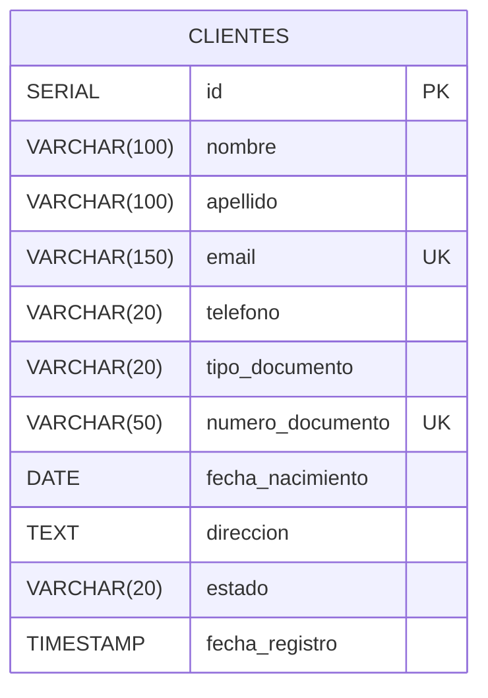
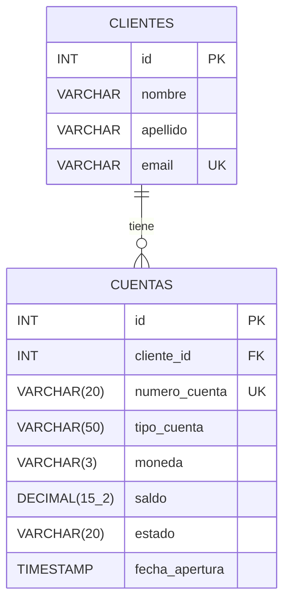
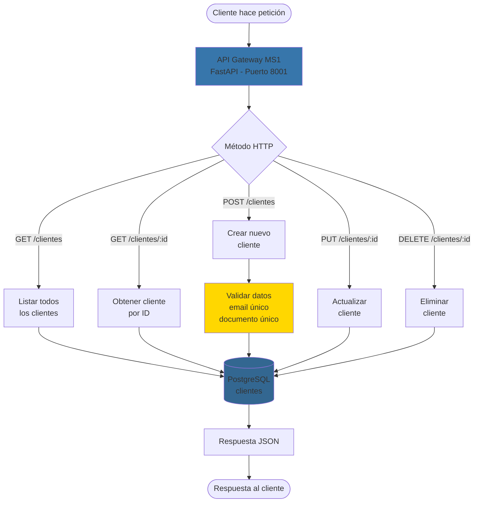
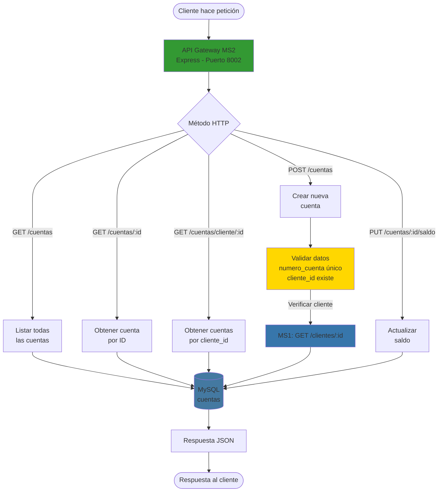
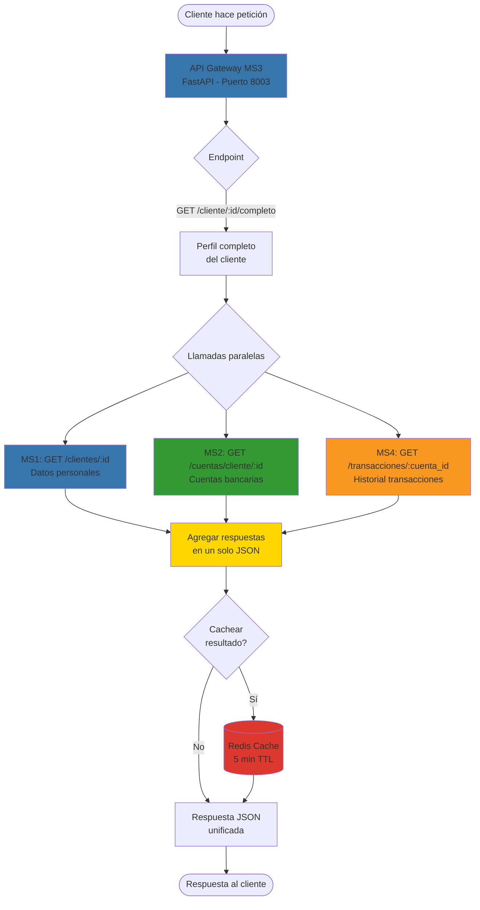
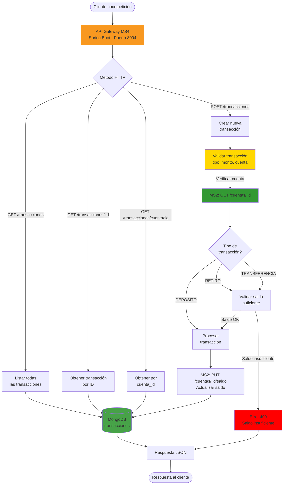
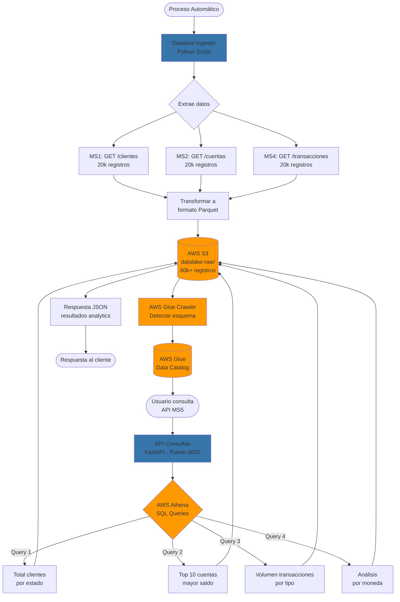
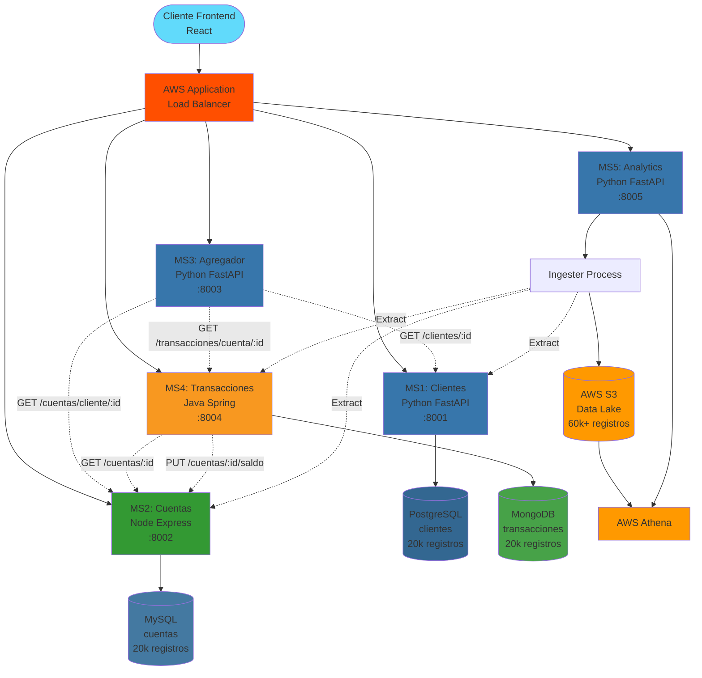

# INSTRUCCIONES PARA GENERAR DIAGRAMAS

Usar https://mermaid.live/ para convertir los siguientes códigos Mermaid a imágenes PNG.

---

## DIAGRAMA 1: Entidad-Relación - PostgreSQL (MS1)

**Archivo:** `er-postgresql.png`

---

## DIAGRAMA 2: Entidad-Relación - MySQL (MS2)

**Archivo:** `er-mysql.png`

---

## DIAGRAMA 3: Flujo MS1 (Gestión de Clientes)

**Archivo:** `flujo-ms1.png`

---

## DIAGRAMA 4: Flujo MS2 (Gestión de Cuentas)

**Archivo:** `flujo-ms2.png`

---

## DIAGRAMA 5: Flujo MS3 (API Agregador)

**Archivo:** `flujo-ms3.png`

---

## DIAGRAMA 6: Flujo MS4 (Transacciones)

**Archivo:** `flujo-ms4.png`

---

## DIAGRAMA 7: Flujo MS5 (Data Lake & Analytics)

**Archivo:** `flujo-ms5.png`

---

## DIAGRAMA 8: Integración Completa entre Microservicios

**Archivo:** `integracion-completa.png`

---

## RESUMEN DE ARCHIVOS A GENERAR:

1. ✅ `er-postgresql.png` - Entidad-Relación PostgreSQL (MS1)
2. ✅ `er-mysql.png` - Entidad-Relación MySQL (MS2)
3. ✅ `flujo-ms1.png` - Flujo MS1 (Clientes)
4. ✅ `flujo-ms2.png` - Flujo MS2 (Cuentas)
5. ✅ `flujo-ms3.png` - Flujo MS3 (Agregador)
6. ✅ `flujo-ms4.png` - Flujo MS4 (Transacciones)
7. ✅ `flujo-ms5.png` - Flujo MS5 (Data Lake)
8. ✅ `integracion-completa.png` - Integración completa sistema

**Total: 8 diagramas**

---

## INSTRUCCIONES DE USO:

1. Ir a https://mermaid.live/
2. Copiar el código Mermaid de cada diagrama
3. Pegar en el editor
4. Ajustar zoom si es necesario
5. Descargar como PNG con el nombre indicado
6. Guardar en `docs/images/`
7. Confirmar que tienes los 8 archivos PNG