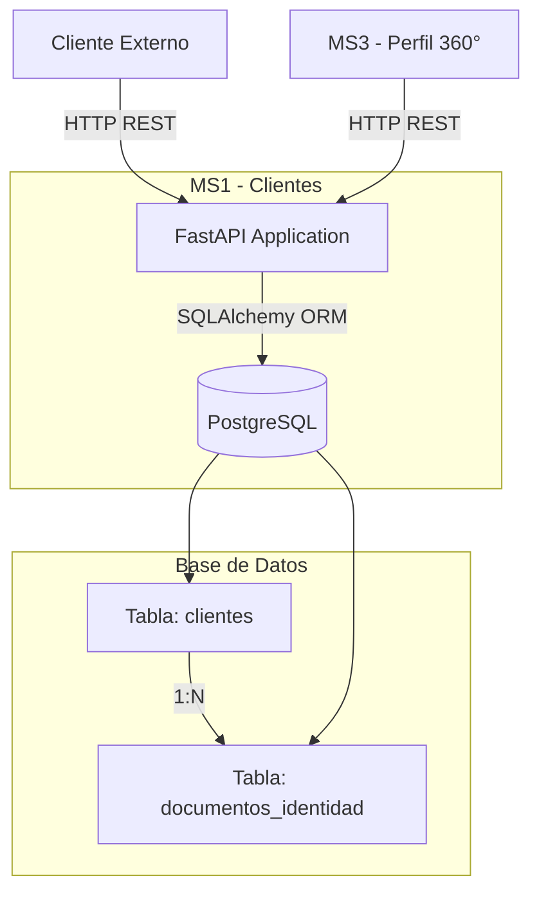

# MS1 - Gestión de Clientes

## 📋 Descripción

Microservicio para la gestión completa de clientes bancarios y sus documentos de identidad. Proporciona operaciones CRUD sobre clientes y permite la asociación de múltiples documentos de identidad por cliente.

## 🎯 Propósito

- Centralizar la información de clientes del banco
- Gestionar datos personales y documentos de identidad
- Proporcionar API REST para otros microservicios
- Mantener integridad referencial con documentos asociados

## 🏗️ Arquitectura



## 🛠️ Tecnologías

| Componente | Tecnología | Versión |
|------------|------------|---------|
| **Lenguaje** | Python | 3.11 |
| **Framework** | FastAPI | 0.104.1 |
| **ORM** | SQLAlchemy | 2.0.23 |
| **Base de Datos** | PostgreSQL | 15 |
| **Servidor** | Uvicorn | 0.24.0 |
| **Validación** | Pydantic | 2.5.0 |
| **Contenedor** | Docker | - |

## 🌐 API Endpoints

### Clientes

| Método | Endpoint | Descripción |
|--------|----------|-------------|
| `GET` | `/clientes` | Listar todos los clientes |
| `GET` | `/clientes/{id}` | Obtener cliente por ID |
| `GET` | `/clientes/email/{email}` | Buscar por email |
| `GET` | `/clientes/documento/{numero}` | Buscar por documento |
| `POST` | `/clientes` | Crear nuevo cliente |
| `PUT` | `/clientes/{id}` | Actualizar cliente |
| `DELETE` | `/clientes/{id}` | Eliminar cliente |

### Documentos

| Método | Endpoint | Descripción |
|--------|----------|-------------|
| `GET` | `/clientes/{id}/documentos` | Listar documentos del cliente |
| `POST` | `/clientes/{id}/documentos` | Agregar documento |

### Utilidades

| Método | Endpoint | Descripción |
|--------|----------|-------------|
| `GET` | `/` | Información del servicio |
| `GET` | `/health` | Health check |
| `GET` | `/docs` | Documentación Swagger UI |

## 📊 Modelo de Datos

### Cliente
```json
{
  "cliente_id": 1,
  "nombre": "Juan",
  "apellido": "Pérez",
  "email": "juan.perez@example.com",
  "telefono": "+51999888777",
  "fecha_registro": "2025-01-15T10:30:00",
  "estado": "activo",
  "documentos": [...]
}
```

### Documento de Identidad
```json
{
  "documento_id": 1,
  "cliente_id": 1,
  "tipo_documento": "DNI",
  "numero_documento": "12345678",
  "fecha_emision": "2020-01-01",
  "fecha_vencimiento": "2030-01-01"
}
```

## 📊 Estructura de Base de Datos

**Tabla `clientes`:**
- `cliente_id` (PK, SERIAL)
- `nombre`, `apellido` (VARCHAR)
- `email` (VARCHAR, UNIQUE)
- `telefono` (VARCHAR)
- `fecha_registro` (TIMESTAMP)
- `estado` (VARCHAR)

**Tabla `documentos_identidad`:**
- `documento_id` (PK, SERIAL)
- `cliente_id` (FK → clientes) - **Relación 1:N**
- `tipo_documento` (VARCHAR)
- `numero_documento` (VARCHAR)
- `fecha_emision`, `fecha_vencimiento` (DATE)

## ☁️ Servicios AWS Utilizados

- **EC2**: Hospedaje del contenedor
- **VPC & Security Groups**: Red y firewall
- **IAM**: Gestión de permisos

## 🚀 Despliegue Rápido

```bash
# En la instancia EC2
cd ~/cloud-bank-service/ms1
docker-compose up -d

# Verificar
curl http://localhost:8001/health
curl http://localhost:8001/docs
```

Ver guía completa: `../docs/DEPLOYMENT_GUIDE.md`

## 🔗 Dependencias

**Consumido por:**
- MS3 (Perfil Cliente 360°)

**Consume:**
- Ninguno (microservicio base)

## � Datos de Prueba

El microservicio cuenta con **10,000 clientes** generados automáticamente usando la biblioteca **Faker** (Python):

### Características de los Datos

| Métrica | Valor |
|---------|-------|
| **Total Clientes** | 10,000 |
| **Generador** | Faker (locale: es_PE) |
| **Estados** | 70% activos, 20% inactivos, 10% suspendidos |
| **Documentos DNI** | 6,000 (60%) |
| **Pasaportes** | 2,500 (25%) |
| **Carnet Extranjería** | 1,500 (15%) |
| **Emails únicos** | 10,000 (sin duplicados) |

### Script de Generación

```bash
# Ejecutar generador de datos
cd ~/cloud-bank-service/ms1
python scripts/generate_fake_data.py --records 10000

# Verificar registros
curl http://localhost:8001/clientes | jq 'length'
```

### Distribución de Datos

- **Nombres**: Realistas para Perú (uso de Faker locale ES-PE)
- **Emails**: Dominios variados (@gmail.com, @hotmail.com, @yahoo.com, etc.)
- **Teléfonos**: Formato peruano (+51 9XX XXX XXX)
- **Fecha de Registro**: Distribuidos en los últimos 5 años
- **Estados**: Weighted random (70/20/10)

## �📖 Documentación Adicional

- **Swagger UI**: `http://{EC2-IP}:8001/docs` ✅
- **OpenAPI Spec**: `http://{EC2-IP}:8001/openapi.json`
- **Esquemas de BD completos**: Ver `../docs/DATABASE_SCHEMAS.md`
- **Ejemplos de API avanzados**: Ver `../docs/API_EXAMPLES.md`
- **Guía de deployment detallada**: Ver `../docs/DEPLOYMENT_GUIDE.md`

## 📝 Notas

- Las operaciones DELETE realizan eliminación en cascada de documentos
- El email debe ser único por cliente
- El estado por defecto es "activo"
- Soporta reintentos automáticos de conexión a PostgreSQL (5 intentos, 5s entre cada uno)
- Base de datos contiene 10,000 registros de prueba para testing y demos
