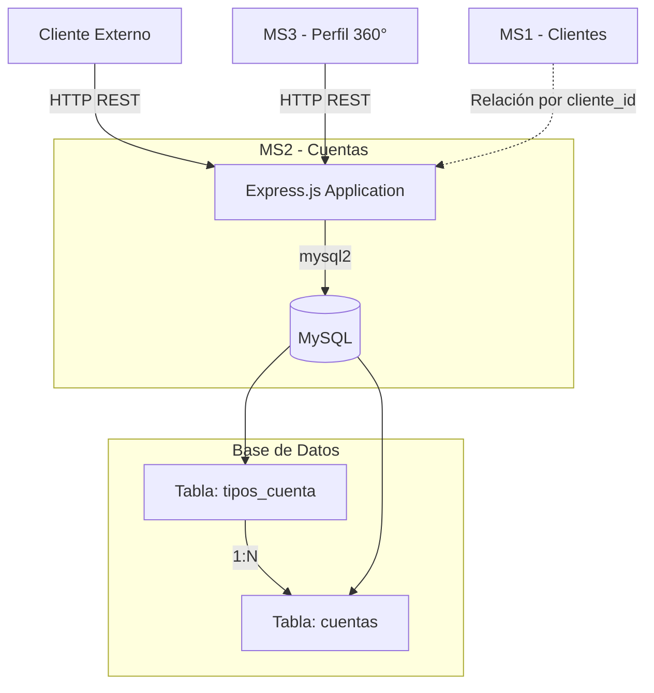

# MS2 - Gestión de Cuentas Bancarias

## 📋 Descripción

Microservicio para la gestión completa de cuentas bancarias y tipos de cuenta. Permite crear, consultar y administrar cuentas asociadas a clientes, definir tipos de cuenta con diferentes características (costo, tasa de interés), y gestionar saldos y transacciones.

## 🎯 Propósito

- Gestionar cuentas bancarias de clientes
- Definir y mantener tipos de cuenta (ahorro, corriente, etc.)
- Controlar saldos y movimientos de cuenta
- Proporcionar API REST para consulta de información de cuentas

## 🏗️ Arquitectura



## 🛠️ Tecnologías

| Componente | Tecnología | Versión |
|------------|------------|---------|
| **Lenguaje** | Node.js | 18 |
| **Framework** | Express | 4.18.2 |
| **Base de Datos** | MySQL | 8.0 |
| **Cliente DB** | mysql2 | 3.6.3 |
| **Documentación** | Swagger UI Express | 5.0.0 |
| **Contenedor** | Docker | - |

## 🌐 API Endpoints

### Tipos de Cuenta

| Método | Endpoint | Descripción |
|--------|----------|-------------|
| `GET` | `/tipos-cuenta` | Listar todos los tipos de cuenta |
| `POST` | `/tipos-cuenta` | Crear nuevo tipo de cuenta |

### Cuentas

| Método | Endpoint | Descripción |
|--------|----------|-------------|
| `GET` | `/cuentas` | Listar todas las cuentas |
| `GET` | `/cuentas/{id}` | Obtener cuenta por ID |
| `GET` | `/cuentas/cliente/{cliente_id}` | Listar cuentas de un cliente |
| `POST` | `/cuentas` | Crear nueva cuenta |
| `PUT` | `/cuentas/{id}` | Actualizar cuenta |
| `DELETE` | `/cuentas/{id}` | Eliminar cuenta |

### Utilidades

| Método | Endpoint | Descripción |
|--------|----------|-------------|
| `GET` | `/` | Información del servicio |
| `GET` | `/health` | Health check |
| `GET` | `/docs` | Documentación Swagger UI |

## 📊 Modelo de Datos

### Tipo de Cuenta
```json
{
  "tipo_cuenta_id": 1,
  "nombre": "Cuenta de Ahorros",
  "descripcion": "Cuenta para ahorro con intereses mensuales",
  "costo_mantenimiento": 10.00,
  "tasa_interes": 2.5,
  "estado": "activo"
}
```

### Cuenta
```json
{
  "cuenta_id": 1,
  "cliente_id": 5,
  "tipo_cuenta_id": 1,
  "numero_cuenta": "1234567890",
  "saldo": 15000.50,
  "moneda": "USD",
  "fecha_apertura": "2025-01-15T10:30:00",
  "estado": "activa"
}
```

## 📊 Estructura de Base de Datos

**Tabla `tipos_cuenta`:**
- `tipo_cuenta_id` (PK, AUTO_INCREMENT)
- `nombre` (VARCHAR, UNIQUE)
- `descripcion` (TEXT)
- `costo_mantenimiento` (DECIMAL(10,2))
- `tasa_interes` (DECIMAL(5,2))
- `estado` (VARCHAR)

**Tabla `cuentas`:**
- `cuenta_id` (PK, AUTO_INCREMENT)
- `cliente_id` (INT) - **Referencia lógica a MS1**
- `tipo_cuenta_id` (FK → tipos_cuenta) - **Relación 1:N**
- `numero_cuenta` (VARCHAR, UNIQUE)
- `saldo` (DECIMAL(15,2))
- `moneda` (VARCHAR)
- `fecha_apertura` (TIMESTAMP)
- `estado` (VARCHAR)

## ☁️ Servicios AWS Utilizados

- **EC2**: 2 instancias t2.small (Alta disponibilidad)
- **Application Load Balancer (ALB)**: Distribución de tráfico
- **Target Group**: Health checks y routing
- **VPC & Security Groups**: Red y firewall
- **IAM**: Gestión de permisos

## 🚀 Despliegue Rápido

```bash
# En la instancia EC2
cd ~/cloud-bank-service/ms2
docker-compose up -d

# Verificar
curl http://localhost:8002/health
curl http://localhost:8002/docs
```

Ver guía completa: `../docs/DEPLOYMENT_GUIDE.md`

## ⚖️ Alta Disponibilidad - Load Balancer

Este microservicio cuenta con **balanceo de carga** para garantizar disponibilidad y escalabilidad:

### Configuración del Load Balancer

| Componente | Detalle |
|------------|---------|
| **Tipo** | AWS Application Load Balancer (ALB) |
| **Instancias EC2** | 2 instancias activas |
| **Algoritmo** | Round Robin |
| **Puerto** | 8002 |
| **Health Check Path** | `/health` |
| **Health Check Interval** | 30 segundos |
| **Timeout** | 5 segundos |
| **Healthy Threshold** | 2 checks exitosos |
| **Unhealthy Threshold** | 2 checks fallidos |

### Arquitectura de Alta Disponibilidad

```
                     ┌─────────────────────┐
                     │   AWS ALB           │
                     │  (Load Balancer)    │
                     └──────────┬──────────┘
                                │
                ┌───────────────┴───────────────┐
                │                               │
         ┌──────▼──────┐               ┌───────▼─────┐
         │   MS2-A     │               │   MS2-B     │
         │ EC2 Instance│               │EC2 Instance │
         │  :8002      │               │  :8002      │
         └──────┬──────┘               └───────┬─────┘
                │                               │
                └───────────────┬───────────────┘
                                │
                        ┌───────▼────────┐
                        │  MySQL DB      │
                        │   (Shared)     │
                        └────────────────┘
```

### Beneficios

- ✅ **Tolerancia a fallos**: Si una instancia falla, el tráfico se redirige automáticamente
- ✅ **Escalabilidad**: Capacidad para manejar 2x más requests por segundo
- ✅ **Zero-downtime deployments**: Actualización sin interrumpir el servicio
- ✅ **Monitoreo**: Métricas de salud en CloudWatch

## 🔗 Dependencias

**Consumido por:**
- MS3 (Perfil Cliente 360°)
- Frontend (a través del ALB)

**Consume:**
- MS1 (relación lógica por `cliente_id`)

## 📊 Datos de Prueba

El microservicio cuenta con **12,000 cuentas bancarias** generadas automáticamente:

### Características de los Datos

| Métrica | Valor |
|---------|-------|
| **Total Cuentas** | 12,000 |
| **Generador** | Script SQL con datos aleatorios |
| **Tipos de Cuenta** | Ahorro (45%), Corriente (30%), Sueldo (15%), Premium (10%) |
| **Monedas** | USD (80%), PEN (15%), EUR (5%) |
| **Rango de Saldos** | $100 - $100,000 |
| **Estados** | 90% activas, 8% suspendidas, 2% cerradas |
| **Promedio por cliente** | 1.2 cuentas |

### Script de Generación

```bash
# Ejecutar generador de datos
cd ~/cloud-bank-service/ms2
mysql -h localhost -u root -p < scripts/generate_accounts.sql

# Verificar registros
curl http://localhost:8002/cuentas | jq 'length'
```

## 📖 Documentación Adicional

- **Swagger UI**: `http://{ALB-DNS}/docs` ✅
- **Esquemas de BD completos**: Ver `../docs/DATABASE_SCHEMAS.md`
- **Ejemplos de API avanzados**: Ver `../docs/API_EXAMPLES.md`
- **Guía de deployment detallada**: Ver `../docs/DEPLOYMENT_GUIDE.md`
- **Configuración ALB**: Ver `docs/LOAD_BALANCER_SETUP.md`

## 📝 Notas

- El campo `cliente_id` no tiene FK física para permitir arquitectura de microservicios desacoplada
- El número de cuenta debe ser único en el sistema
- El saldo puede ser negativo (sobregiro permitido según tipo de cuenta)
- **Load Balancer activo** con 2 instancias para alta disponibilidad
- Base de datos contiene 12,000 registros de prueba distribuidos por tipo
