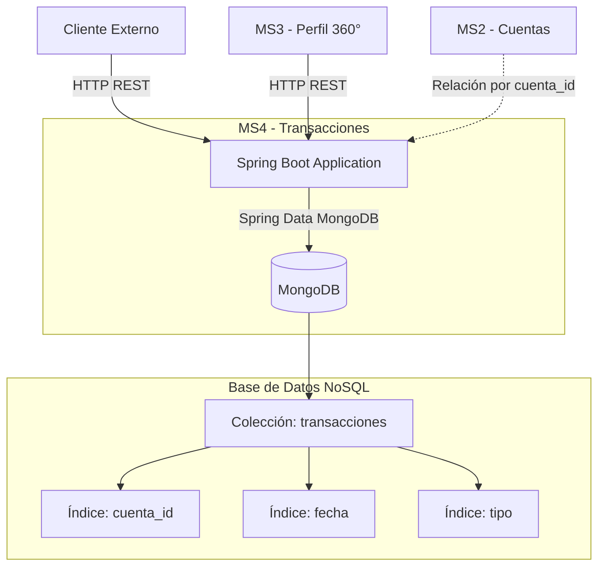

# MS4 - Gestión de Transacciones Bancarias

## 📋 Descripción

Microservicio para el registro, seguimiento y gestión de transacciones bancarias. Utiliza MongoDB para almacenar el historial completo de operaciones financieras (depósitos, retiros, transferencias) con esquema flexible que permite adaptarse a diferentes tipos de transacciones.

## 🎯 Propósito

- Registrar todas las transacciones bancarias del sistema
- Proporcionar historial de movimientos por cuenta
- Permitir consultas y filtros por fecha, tipo, monto
- Mantener auditoría completa de operaciones financieras

## 🏗️ Arquitectura


```mermaid
graph TB
    subgraph "MS4 - Transacciones"
        API[Spring Boot Application]
        DB[(MongoDB)]
        
        API -->|Spring Data MongoDB| DB
    end
    
    Client[Cliente Externo] -->|HTTP REST| API
    MS3[MS3 - Perfil 360°] -->|HTTP REST| API
    MS2[MS2 - Cuentas] -.->|Relación por cuenta_id| API
    
    subgraph "Base de Datos NoSQL"
        COL[Colección: transacciones]
        IDX1[Índice: cuenta_id]
        IDX2[Índice: fecha]
        IDX3[Índice: tipo]
        
        COL --> IDX1
        COL --> IDX2
        COL --> IDX3
    end
    
    DB --> COL
```

## 🛠️ Tecnologías

| Componente | Tecnología | Versión |
|------------|------------|---------|
| **Lenguaje** | Java | 17 |
| **Framework** | Spring Boot | 3.2.1 |
| **Base de Datos** | MongoDB | 7.0 |
| **Driver** | Spring Data MongoDB | 3.2.1 |
| **Documentación** | SpringDoc OpenAPI | 2.3.0 |
| **Build Tool** | Maven | 3.8+ |
| **Contenedor** | Docker | - |

## 🌐 API Endpoints

### Transacciones

| Método | Endpoint | Descripción |
|--------|----------|-------------|
| `GET` | `/transacciones` | Listar todas las transacciones |
| `GET` | `/transacciones/{id}` | Obtener transacción por ID |
| `GET` | `/transacciones/cuenta/{cuenta_id}` | Historial por cuenta |
| `GET` | `/transacciones/tipo/{tipo}` | Filtrar por tipo (DEPOSITO, RETIRO, TRANSFERENCIA) |
| `GET` | `/transacciones/fecha?inicio={date}&fin={date}` | Filtrar por rango de fechas |
| `POST` | `/transacciones` | Crear nueva transacción |
| `PUT` | `/transacciones/{id}` | Actualizar transacción |
| `DELETE` | `/transacciones/{id}` | Eliminar transacción |

### Utilidades

| Método | Endpoint | Descripción |
|--------|----------|-------------|
| `GET` | `/` | Información del servicio |
| `GET` | `/health` | Health check |
| `GET` | `/docs` | Documentación Swagger UI |

## 📊 Modelo de Datos

### Transacción
```json
{
  "_id": "507f1f77bcf86cd799439011",
  "cuenta_id": 123,
  "tipo": "TRANSFERENCIA",
  "monto": 500.00,
  "moneda": "USD",
  "descripcion": "Pago de servicios",
  "fecha": "2025-01-15T14:30:00Z",
  "estado": "completada",
  "referencia": "TRX-2025-001234",
  "metadata": {
    "origen": "1234567890",
    "destino": "0987654321",
    "canal": "web",
    "ip": "192.168.1.100"
  }
}
```

### Tipos de Transacción
- **DEPOSITO**: Ingreso de fondos a la cuenta
- **RETIRO**: Extracción de fondos
- **TRANSFERENCIA**: Movimiento entre cuentas

### Estados
- **pendiente**: En proceso de validación
- **completada**: Ejecutada exitosamente
- **rechazada**: No se pudo completar
- **revertida**: Anulada después de ejecución

## 📊 Estructura de Base de Datos

**Colección `transacciones`:**
- `_id` (ObjectId, PK)
- `cuenta_id` (Integer, indexado) - **Referencia lógica a MS2**
- `tipo` (String, enum: DEPOSITO | RETIRO | TRANSFERENCIA)
- `monto` (Decimal128)
- `moneda` (String)
- `descripcion` (String)
- `fecha` (ISODate, indexado)
- `estado` (String, enum)
- `referencia` (String, unique)
- `metadata` (Object, flexible)

**Índices:**
- `cuenta_id` (ascendente)
- `fecha` (descendente)
- `tipo` (ascendente)
- `referencia` (único)

## ☁️ Servicios AWS Utilizados

- **EC2**: Hospedaje del contenedor
- **VPC & Security Groups**: Red y firewall
- **IAM**: Gestión de permisos

## 🚀 Despliegue Rápido

```bash
# En la instancia EC2
cd ~/cloud-bank-service/ms4
docker-compose up -d

# Verificar (Spring Boot tarda ~1-2 min en iniciar)
curl http://localhost:8004/health
curl http://localhost:8004/docs
```

Ver guía completa: `../docs/DEPLOYMENT_GUIDE.md`

## 🔗 Dependencias

**Consumido por:**
- MS3 (Perfil Cliente 360°)

**Consume:**
- MS2 (relación lógica por `cuenta_id`)

## � Datos de Prueba

El microservicio cuenta con **15,000 transacciones históricas** generadas automáticamente:

### Características de los Datos

| Métrica | Valor |
|---------|-------|
| **Total Transacciones** | 15,000 |
| **Generador** | Script Java con RandomDataGenerator |
| **Período** | Últimos 12 meses (2024-2025) |
| **Tipos** | DEPOSITO (45%), RETIRO (35%), TRANSFERENCIA (20%) |
| **Rango de Montos** | $10 - $50,000 |
| **Estados** | Completada (85%), Pendiente (10%), Rechazada (5%) |
| **Monedas** | USD (80%), PEN (15%), EUR (5%) |

### Distribución Temporal

```
Transacciones por Mes:
Enero 2024    : 1,200 transacciones
Febrero 2024  : 1,180 transacciones
Marzo 2024    : 1,320 transacciones
...
Diciembre 2024: 1,450 transacciones
Enero 2025    : 1,500 transacciones
```

### Patrones de Datos Realistas

- **DEPOSITO**: Montos promedio $2,500, horarios laborales (9am-6pm)
- **RETIRO**: Montos promedio $500, distribución uniforme 24/7
- **TRANSFERENCIA**: Montos promedio $1,200, incluye metadata de origen/destino

### Script de Generación

```bash
# Ejecutar generador de datos
cd ~/cloud-bank-service/ms4
mvn exec:java -Dexec.mainClass="com.cloudbank.transacciones.DataGenerator"

# Verificar registros
curl http://localhost:8004/transacciones | jq 'length'
```

### Índices Optimizados

Para consultas eficientes con 15,000+ registros:
- `cuenta_id` (ascendente) - Búsqueda por cuenta
- `fecha` (descendente) - Ordenamiento temporal
- `tipo` (ascendente) - Filtrado por tipo
- `referencia` (único) - Búsqueda exacta
- `estado` + `fecha` (compuesto) - Queries analíticas

## 📖 Documentación Adicional

- **Swagger UI**: `http://{EC2-IP}:8004/docs` ✅
- **OpenAPI Spec**: `http://{EC2-IP}:8004/api-docs`
- **Esquemas de BD completos**: Ver `../docs/DATABASE_SCHEMAS.md`
- **Ejemplos de API avanzados**: Ver `../docs/API_EXAMPLES.md`
- **Guía de deployment detallada**: Ver `../docs/DEPLOYMENT_GUIDE.md`

## 📝 Notas

- Spring Boot tarda aproximadamente 1-2 minutos en iniciar completamente
- El campo `cuenta_id` no tiene FK física para arquitectura de microservicios desacoplada
- MongoDB permite schema flexible para diferentes tipos de transacciones
- El campo `metadata` puede contener información adicional según el tipo de transacción
- Base de datos contiene 15,000 transacciones de los últimos 12 meses
- TTL index configurado para archivar transacciones mayores a 2 años
- Índices optimizados para consultas de alto volumen
